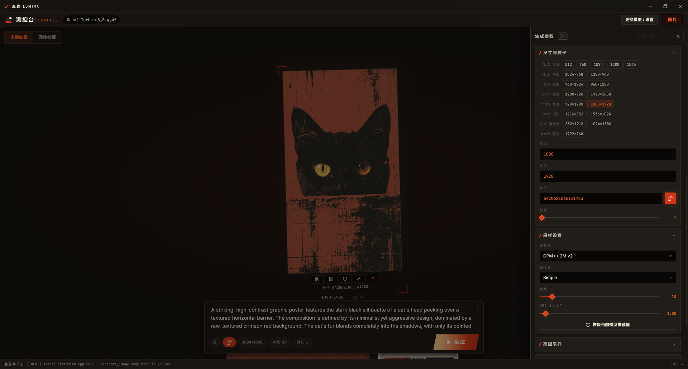
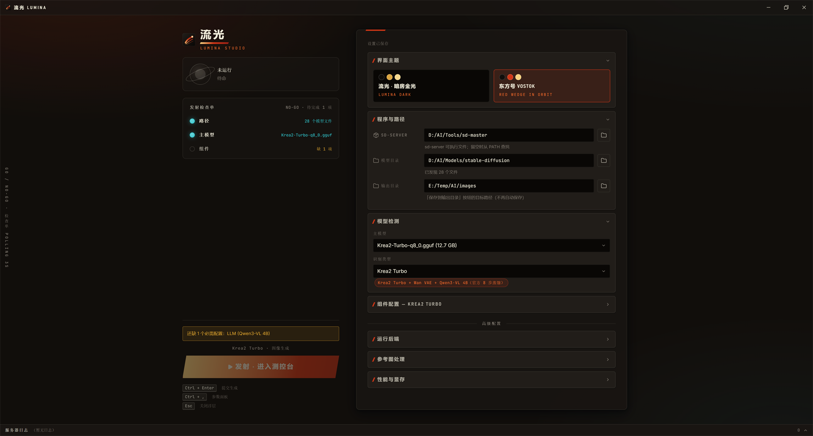

# 流光 Lumina


[stable-diffusion.cpp](https://github.com/leejet/stable-diffusion.cpp) 的第三方桌面客户端。它负责启动和看管 `sd-server`，并提供一套完整的图片 / 视频生成界面，可以替代上游自带的 webui。不隶属于上游项目，独立开发和发布。

`sd-server` 的门槛主要在启动那一步。不同模型家族要的组件完全不同：Flux.1 要 diffusion 模型加 VAE、CLIP-L、T5-XXL，Wan 换成 UMT5，MiniMax-H3 还要视频 VAE、音频 VAE 和一个 32B 的 Qwen3-VL。少给一个或者路径写错，进程直接退出，原因埋在日志里。Lumina 把这一步变成一张检查单：扫描模型目录、认出家族、列出还缺什么，顺手校验 `--max-vram`、`--backend` 这类容易写错的参数，齐了才让你按启动。

启动之后进入生成界面，当前家族的推荐参数、尺寸与帧数预设都已经填好，写完提示词就能出图。



## 安装

### 用安装包

从 [Releases](https://github.com/AmeowCAT/lumina/releases) 下载 MSI 或 NSIS 安装包装上即可。

界面本身不含推理内核，你需要自备编译好的 `sd-server`（见上游[构建说明](https://github.com/leejet/stable-diffusion.cpp/blob/master/docs/build.md)），把它所在目录填进控制台即可，已在 `PATH` 里则留空。

### 从源码构建

前置：Node.js 20.19+（仓库带 `.nvmrc`）、Rust stable、以及 Tauri 在你平台上的[系统依赖](https://tauri.app/start/prerequisites/)。

```bash
git clone https://github.com/AmeowCAT/lumina.git
cd lumina
npm install

npm run tauri dev      # 开发模式，前端热更新
npm run tauri build    # 打包安装包
```

Windows 上 `tauri build` 产出两个安装包和一个免安装可执行文件：

```
src-tauri/target/release/bundle/msi/Lumina_<版本>_x64_en-US.msi
src-tauri/target/release/bundle/nsis/Lumina_<版本>_x64-setup.exe
src-tauri/target/release/lumina.exe
```

日常开发与验证都在 Windows 上进行。依赖本身跨平台，macOS 与 Linux 应该能构建，但没有 CI，也没有系统性验证过。

## 上手

### 控制台



1. **程序与路径**：选 `sd-server` 所在目录（在 `PATH` 里可留空）、模型根目录、输出目录。模型目录会被扫描归类，支持 ComfyUI 那种分目录结构，分片模型只显示 `.safetensors.index.json` 索引、隐藏碎片。
2. **模型检测**：选主模型，家族自动识别，识别错了可以手动覆盖。
3. **组件配置**：按家族列出需要的组件，可选项标了"（可选）"，下方给出该家族该用哪种权重的说明。
4. 检查单全绿后点**启动服务器**，加载完成会自动进入生成界面。

运行后端、参考图处理、性能与显存三块折叠面板放着 `--backend`、`--type` 量化、CPU 卸载、`--max-vram`、队列上限、启动端口和附加启动参数。

启动失败或者想看加载进度时，展开底部的服务器日志面板，`sd-server` 的 stdout / stderr 都在那里。

### 生成界面

底部提示栏写正向 / 反向提示词，旁边的尺寸、步数、CFG 三个 chip 点一下就在原地弹出滑杆。完整参数按 `Ctrl` + `,` 调出，采样、图片输入、LoRA、二次放大、输出格式各占一块，视频家族会多出高噪段与帧数相关的项。

参数面板里的"额外采样参数"是给上游 `extra_sample_args` 留的出口，界面没做专门控件的键（`gamma`、`apg_eta`、`base_shift`、`guidance_schedule` 等）都能从这里下达，写法是 `key=value` 逗号分隔。

### 键位

| 键位 | 作用 |
|---|---|
| `Ctrl` + `Enter` | 提交生成 |
| `Ctrl` + `,` | 打开 / 关闭参数面板 |
| `Ctrl` + `R` | 切换随机种子 |
| `Esc` | 关闭当前浮层（预览 / 参数面板 / 任务队列） |
| `←` `→` | 预览中切换上一张 / 下一张 |
| `+` `-` `0` | 预览中放大 / 缩小 / 复位 |

### 配置存在哪

- 启动配置：系统配置目录下的 `lumina/settings.json`（Windows `%APPDATA%`，Linux `~/.config`，macOS `~/Library/Application Support`）。每个模型的组件与运行参数按快照保存，下次选中同一模型自动恢复。
- 生成参数：按模式缓存在 `localStorage`（`sdcpp:params:*`），不进 `settings.json`。
- 端口：默认 `127.0.0.1:1234`，与上游 webui 一致，可在控制台改成 1024–65535 之间任意端口，重启服务器生效。

## 遇到问题先看这里

- **扫描不出模型**：只认 `.safetensors` / `.sft` / `.gguf` / `.ckpt` / `.pt` / `.pth`，目录最多向下三层，单次最多 5000 个文件。被跳过的东西会写在检测面板的扫描警告里。
- **端口被占用**：Lumina 不会去杀不认识的进程。要么释放端口，要么在控制台改一个。如果那个端口上本来就是一个能应答的 `sd-server`，它会被直接接管，不会再起一个。`--listen-port` / `--listen-ip` 写在附加启动参数里会被拒绝，界面所有请求都靠这个端口代理。
- **启动就退出**：先看日志面板最后几行。组件路径、`--max-vram` 写法、`--backend` 设备名这三类问题界面会提前拦，剩下的基本是权重本身不被上游识别，属于上游范畴。
- **显存不足**：打开 CPU 卸载、启用 VAE 分块、换 TAE 解码、降低尺寸与帧数、用量化权重。上游的[性能指南](https://github.com/leejet/stable-diffusion.cpp/blob/master/docs/performance.md)和[后端选择](https://github.com/leejet/stable-diffusion.cpp/blob/master/docs/backend.md)讲得更细。

## 与上游的关系

推理、模型支持、显存表现全部来自 `stable-diffusion.cpp`，这个仓库只做界面和进程管理。所以：

- 界面、启动流程、参数映射有问题 → 提到[本仓库 Issues](https://github.com/AmeowCAT/lumina/issues)
- 出图质量、加载失败、显存不足、模型不被识别 → 提到[上游仓库](https://github.com/leejet/stable-diffusion.cpp/issues)

<details>
<summary>已适配的模型家族（47 个，外加"自定义"）</summary>

Flux.1、Kontext、Flux.2-dev、Flux.2-klein（含 Base）、SDXL、SD 1.x/2.x（含 AnimateDiff img2video）、SD3/3.5、PiD / PiD 1.5、Wan T2V、Wan I2V/FLF2V、Wan TI2V、Wan2.2 A14B、LingBot Video、HunyuanVideo 1.5、MiniMax-H3（FL2VA / Ref2VA）、Z-Image（含 Turbo）、Qwen-Image（含 Layered/Edit）、Mage-Flow（含 Turbo/Edit/Edit Turbo）、Chroma（含 Radiance）、LTX-Video、Ideogram4、HiDream-O1、ERNIE-Image（含 Turbo）、Anima、Krea2（含 Turbo）、SeFi-Image（含 Turbo）、Lens（含 Turbo）、Boogu Image（Base/Edit/Turbo）、LongCat、Ovis-Image、MiniT2I、Distilled SD（SSD-1B/SDXS），以及"自定义"（手动配置全部组件）。

</details>

## 已知限制

- 生成结果只在内存里，要留档得点"保存到输出目录"或另存为。
- 监听地址固定 `127.0.0.1`，只有端口可配，不支持对外提供服务。
- 提示词里的 LoRA 标签（`<lora:...>`）不生效，这是服务端 API 的限制，LoRA 请在参数面板里选。
- MiniMax-H3 Ref2VA 只能通过 HTTP 传参考图，参考视频 / 音频目前仅 `sd-cli` 通道有，界面因此要求必须给参考图。
- AnimateDiff 的运动模块原生训练在 16 帧，位置编码最多 32 帧，超出后画面趋于静止。
- 上游 `/sdcpp/v1` 不开放 ADetailer 与独立放大模式，这两块界面里没有。
- 没有 CI，发布包是本地构建的。

## 开发

```bash
npm run dev      # 只跑前端（端口 1420），不带 Tauri 壳
npm run build    # tsc + vite build
npm test         # Vitest
cd src-tauri && cargo test
```

前端不直接发 HTTP，所有请求经类型化的 Tauri 命令由 Rust 侧代理，页面 CSP 只放行 `http://127.0.0.1:*`。模型家族识别也只有 `family.rs` 一份实现，避免两边规则各自漂移。

```
src/
├── App.tsx              # 阶段机：检查 → 控制台 → 工作室
├── store.ts             # Zustand，设置 / 任务 / 结果 / 日志
├── api.ts               # Tauri 命令的类型化封装
├── config/families.ts   # 家族元数据、尺寸与帧数预设、采样器显示名
├── lib/                 # 请求体构造、启动参数校验、元数据映射、主题
├── hooks/               # 任务轮询、模型切换、快捷键、系统集成
└── components/
    ├── dashboard/       # 控制台
    ├── generation/      # 工作室：提示栏、参数面板、结果、任务队列、历史
    └── ui/              # Radix 封装与基础组件

src-tauri/src/
├── server.rs      # 进程生命周期、启动参数拼装与校验、日志流
├── scanner.rs     # 模型目录扫描、分片索引、警告收集
├── family.rs      # 家族与组件识别（唯一实现）
├── sdcpp.rs       # /sdcpp/v1 HTTP 代理
├── settings.rs    # 设置读写、迁移、损坏文件备份
├── png_info.rs    # PNG / WebP 元数据解析
└── save.rs        # 落盘与输出目录边界校验
```

技术栈：Tauri 2、React 18、TypeScript、Zustand、Vite、Tailwind CSS 4、Radix UI、motion、Vitest。Rust 侧是 Tokio、reqwest、rfd。

版本号以 `package.json` 为唯一来源，`npm version` 的钩子会同步到 `tauri.conf.json`、`Cargo.toml` 和 `Cargo.lock`。

## 友情链接

- [LINUX DO](https://linux.do/)

## 许可证

Copyright (C) 2026 AmeowCAT

本项目按 [GNU Affero General Public License v3.0 或更新版本](LICENSE) 发布。你可以自由使用、修改和再分发，但分发衍生版本（包括把它改造后提供给别人使用）时必须同样以 AGPL 开放完整源码。更早的版本曾以 MIT 与 Apache-2.0 发布，已经拿到的副本仍然适用当时的条款。

推理内核 `stable-diffusion.cpp` 是独立的 MIT 项目，本程序只是启动它的可执行文件并通过 HTTP 通信，不包含也不链接它的代码，两者的许可互不影响。
